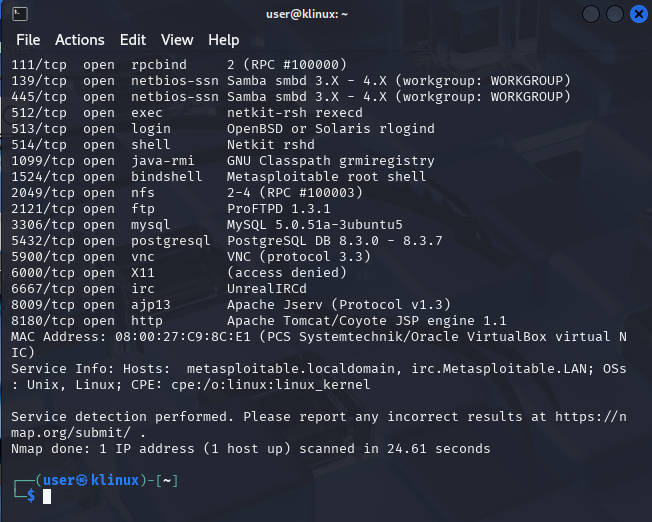
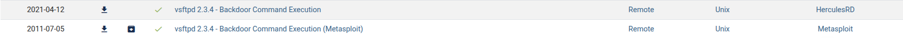

# Домашнее задание к занятию "`Уязвимости и атаки на информационные системы`" - `Болтунов Алексей`

### Инструкция по выполнению домашнего задания

   1. Сделайте `fork` данного репозитория к себе в Github и переименуйте его по названию или номеру занятия, например, https://github.com/имя-вашего-репозитория/git-hw или  https://github.com/имя-вашего-репозитория/7-1-ansible-hw).
   2. Выполните клонирование данного репозитория к себе на ПК с помощью команды `git clone`.
   3. Выполните домашнее задание и заполните у себя локально этот файл README.md:
      - впишите вверху название занятия и вашу фамилию и имя
      - в каждом задании добавьте решение в требуемом виде (текст/код/скриншоты/ссылка)
      - для корректного добавления скриншотов воспользуйтесь [инструкцией "Как вставить скриншот в шаблон с решением](https://github.com/netology-code/sys-pattern-homework/blob/main/screen-instruction.md)
      - при оформлении используйте возможности языка разметки md (коротко об этом можно посмотреть в [инструкции  по MarkDown](https://github.com/netology-code/sys-pattern-homework/blob/main/md-instruction.md))
   4. После завершения работы над домашним заданием сделайте коммит (`git commit -m "comment"`) и отправьте его на Github (`git push origin`);
   5. Для проверки домашнего задания преподавателем в личном кабинете прикрепите и отправьте ссылку на решение в виде md-файла в вашем Github.
   6. Любые вопросы по выполнению заданий спрашивайте в чате учебной группы и/или в разделе “Вопросы по заданию” в личном кабинете.
   
Желаем успехов в выполнении домашнего задания!
   
### Дополнительные материалы, которые могут быть полезны для выполнения задания

1. [Руководство по оформлению Markdown файлов](https://gist.github.com/Jekins/2bf2d0638163f1294637#Code)

---

### Задание 1

`Приведите ответ в свободной форме........`

1. Samba 3.0.20 (CVE-2007-2447)
Порт: 139/445
EDB-ID: 16320
Описание: Уязвимость позволяет выполнить произвольные команды через параметр username map script без аутентификации.
2. vsftpd 2.3.4 (CVE-2011-2523)
Порт: 21
EDB-ID: 17491
Описание: Бэкдор в FTP-сервере: отправка USER username:) открывает shell на порту 6200.
3. UnrealIRCd (CVE-2010-2075)
Порт: 6667
EDB-ID: 13873
Описание: Бэкдор в IRC-сервере позволяет выполнять shell-команды через сообщение 

---

### Задание 2

`Приведите ответ в свободной форме........`

1. `При сканировании в режимах SYN, FIN, Xmas и UDP Nmap использует разные типы сетевых пакетов, чтобы определить состояние портов (открыт/закрыт/фильтруется). Эти методы отличаются как структурой отправляемых пакетов, так и реакцией целевой системы.

SYN-сканирование — это полуоткрытый TCP-скан. Nmap отправляет пакет с флагом SYN на целевой порт. Если порт открыт, сервер отвечает пакетом SYN-ACK. Если закрыт — отправляет RST. Этот метод быстрый и надёжный, но требует прав суперпользователя, так как работает на низком сетевом уровне.

FIN-сканирование отправляет TCP-пакет с установленным только флагом FIN (обычно используется для завершения соединения). Согласно стандарту RFC, открытый порт должен игнорировать такой пакет, а закрытый — отвечать RST. Поэтому отсутствие ответа интерпретируется как «порт открыт или фильтруется».

Xmas-сканирование («рождественское») получило название потому, что в пакете «горят» сразу три флага: FIN, PSH и URG — как огни на ёлке. Поведение сервера при этом такое же, как при FIN-скане: открытый порт молчит, закрытый отвечает RST.

UDP-сканирование работает иначе, так как UDP — протокол без установления соединения. Nmap отправляет пустой UDP-пакет на порт. Если порт закрыт, система обычно отвечает ICMP-сообщением «Port unreachable» (тип 3, код 3). Если порт открыт, сервис может ответить (например, DNS или SNMP), но часто — молчит. Поэтому отсутствие ответа не даёт однозначного вывода: порт может быть как открытым, так и фильтруемым фаерволом.

Metasploitable — это уязвимая система без фаервола, поэтому она отвечает строго по спецификациям TCP/IP. При SYN-скане она чётко отвечает SYN-ACK на открытые порты и RST на закрытые. При FIN и Xmas — молчит на открытые порты и отправляет RST на закрытые. При UDP-скане на закрытые порты приходит ICMP-ошибка, а на открытые — либо служебный ответ от сервиса (например, от DNS), либо ничего.

`

---
